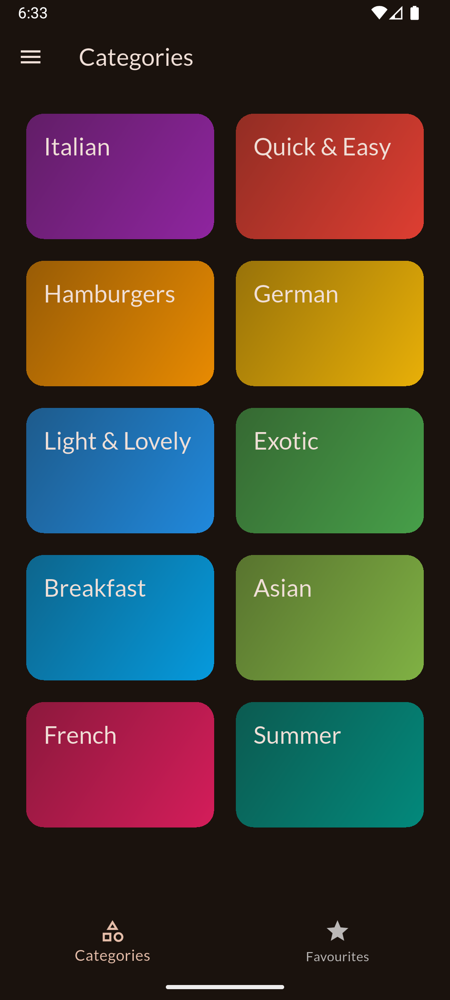
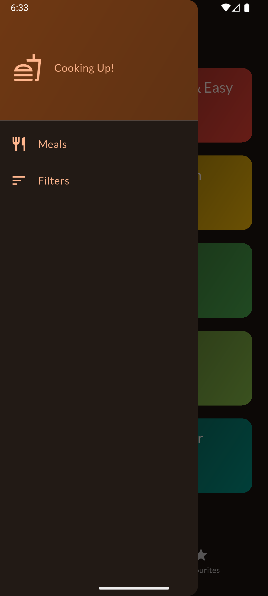
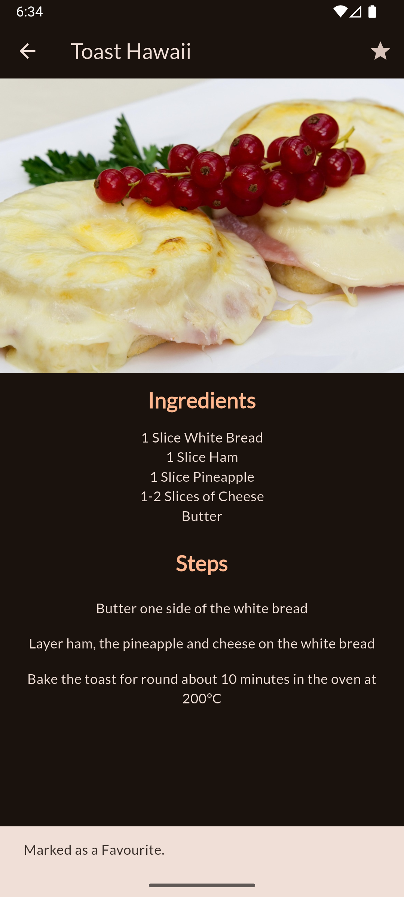
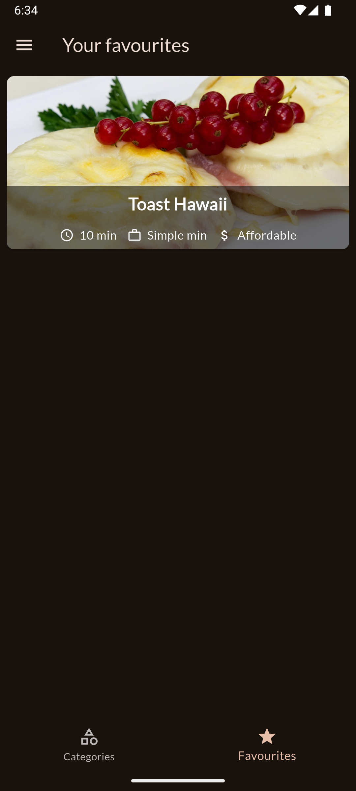

# Meals App

A Flutter app for exploring meals with filters like Gluten-Free, Lactose-Free, Vegan, and Vegetarian.  
Built with modern Flutter widgets (PopScope, SwitchListTile, Navigator.pop with map results) to ensure a clean, maintainable structure.

---

## Features

- Filter meals by diet type (Gluten-Free, Lactose-Free, Vegan, Vegetarian)
- Modern UI using Material 3 design
- Smooth navigation and state management
- Compatible with the latest Flutter version (3.13+)

---

## Tech Stack

- Flutter – UI framework
- Dart – programming language
- Material Design – for responsive layout
- PopScope – for handling back navigation

---

## UI Screens

<div align="center">
  
  
  
  
  
  
</div>

---

## Getting Started

To run this project locally:

```bash
git clone https://github.com/yourusername/meals.git
cd meals
flutter pub get
flutter run
